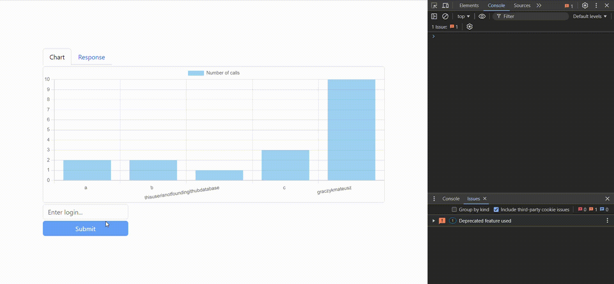

## Github statistics

[](https://dl.circleci.com/status-badge/redirect/gh/GraczykMateusz/github-statistics/tree/master)

### This is upgraded version of this project:
https://github.com/GraczykMateusz/rest-exercise

### Application Requirements

The application should meet the following requirements:

- [x] User Login Input: Allow users to input a login and display a response.
- [x] Event Dispatch: Regardless of whether the login is found, asynchronously send an event to log the attempt in the database.
- [x] Real-Time Updates: Listen for changes in the database and display these changes in real-time on a chart using Kafka, Debezium and Websocket.
- [x] Responsiveness: The application should be responsive, providing an optimal user experience across various devices and screen sizes.
- [x] API Documentation: Include Swagger UI to visualize and interact with the API.
- [x] Automated Testing: Include unit tests, integration tests, and end-to-end (e2e) tests. These tests should be automatically executed during the CI build process.

### Run on docker:

Each step should be executed inside the github-statistics directory.

#### Step 1: Build package
```
mvn verify -P local
```

#### Step 2: Build docker image
```
 docker build . -t github-statistics-app 
```

#### Step 3: Run other services
```
docker compose -f docker-compose.yaml -f docker-compose.e2e.yaml up -d
```

#### Step 4: Wait for the connector setup to complete its task

###### Connector setup - running


###### Connector setup - complete


###### The response inside connector-setup should be similar as shown below
```json
{"version":"3.7.0","commit":"2ae524ed625438c5","kafka_cluster_id":"fXjm_QzARxCEt3EfIL0ygw"}{"name":"postgresql-connector","config":{"connector.class":"io.debezium.connector.postgresql.PostgresConnector","topic.prefix":"pg-changes","database.user":"postgres","database.dbname":"db_local","table.exclude.list":"audit","database.hostname":"database","database.password":"postgres","plugin.name":"pgoutput","name":"postgresql-connector"},"tasks":[],"type":"source"}
```

#### Step 5: Run image
```
docker run -p 8081:8081 --net=github-statistics_default -d -e SPRING_PROFILES_ACTIVE=e2e github-statistics-app:latest
```

#### Step 6: Enter website:
```
http://localhost:8081/#/dashboard
```

#### Optional: 
You can run end-to-end tests locally, but the application doesn't work after creating and running the Docker image because a separate profile is not specified.
```
mvn verify -P e2e
```

-----------------

### Presentation



### Screenshots


